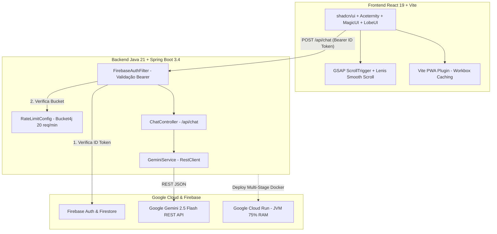

# 🧠 Memória Técnica e Arquitetura de Referência - Diurno (Stack 2026)

Este documento centraliza e formaliza a **Memória Técnica e Base de Referências** do **Diurno** (anteriormente Rotina Inteligente), integrando todas as documentações oficiais, repositórios de referência e boas práticas arquiteturais do nosso ecossistema Frontend e Backend.

---

## 📊 Tabela Mestra de Tecnologias, Bibliotecas e Documentações Registradas

| Categoria | Tecnologia / Repositório | Documentação & Referência Oficial | Arquivo / Componente Principal no Diurno | Regra de Ouro / Boas Práticas |
| :--- | :--- | :--- | :--- | :--- |
| **UI / Efeitos** | **Aceternity UI** | https://github.com/aceternity/ui | [BentoGrid.tsx](file:///c:/Users/marqu/OneDrive/Documentos/rotinAI/src/components/effects/BentoGrid.tsx)<br/>[AuroraBackground.tsx](file:///c:/Users/marqu/OneDrive/Documentos/rotinAI/src/components/effects/AuroraBackground.tsx)<br/>[SpotlightCard.tsx](file:///c:/Users/marqu/OneDrive/Documentos/rotinAI/src/components/effects/SpotlightCard.tsx) | Componentes animados e modulares com classes dinâmicas e Framer Motion. |
| **UI / Base** | **shadcn/ui** | https://github.com/shadcn-ui/ui | [src/components/ui](file:///c:/Users/marqu/OneDrive/Documentos/rotinAI/src/components/ui)<br/>[src/components/composed](file:///c:/Users/marqu/OneDrive/Documentos/rotinAI/src/components/composed) | Primitivas acessíveis e tokens consistentes no Tailwind CSS 4. |
| **UI / IA Chat** | **Lobe UI** | https://github.com/lobehub/lobe-ui | [AIChatWidget.tsx](file:///c:/Users/marqu/OneDrive/Documentos/rotinAI/src/components/AIChatWidget.tsx) | Interface conversacional moderna orientada a agentes generativos e micro-interações. |
| **UI / Motion** | **Magic UI** | https://github.com/magicuidesign/magicui | [BorderBeam.tsx](file:///c:/Users/marqu/OneDrive/Documentos/rotinAI/src/components/effects/BorderBeam.tsx)<br/>[AnimatedTitle.tsx](file:///c:/Users/marqu/OneDrive/Documentos/rotinAI/src/components/effects/AnimatedTitle.tsx)<br/>[Confetti.tsx](file:///c:/Users/marqu/OneDrive/Documentos/rotinAI/src/components/effects/Confetti.tsx) | Animações de impacto visual para seções de destaque, conversão e celebração. |
| **Animação** | **Framer Motion** | https://github.com/framer/motion | Vários componentes em `src/components/` | Transições declarativas focadas em performance visual e suavidade. |
| **Animação / Scroll** | **GSAP & ScrollTrigger** | https://github.com/greensock/GSAP | [ScrollExperienceSection.tsx](file:///c:/Users/marqu/OneDrive/Documentos/rotinAI/src/components/landing/ScrollExperienceSection.tsx) | Storytelling e animações de scroll pino/timeline encapsuladas com `useGSAP`. |
| **Scroll Suave** | **Lenis Smooth Scroll** | https://github.com/studio-freight/lenis | [use-lenis.ts](file:///c:/Users/marqu/OneDrive/Documentos/rotinAI/src/hooks/use-lenis.ts) | Scroll inercial contínuo (`duration: 1.2`), integrado ao requestAnimationFrame. |
| **PWA** | **Vite PWA Plugin** | https://github.com/vite-pwa/vite-plugin-pwa | [vite.config.ts](file:///c:/Users/marqu/OneDrive/Documentos/rotinAI/vite.config.ts) | Configuração zero-config de Service Workers, manifest e cache Workbox. |
| **PWA / Padrões** | **Next-PWA** | https://github.com/shadowwalker/next-pwa | Padrões de caching e offline-first | Modelagem de estratégias de cache para fontes, assets estáticos e navegação. |
| **Backend / Rate Limit** | **Bucket4j** | https://github.com/bucket4j/bucket4j | [RateLimitConfig.java](file:///c:/Users/marqu/OneDrive/Documentos/rotinAI/backend-java/src/main/java/com/diurno/backend/config/RateLimitConfig.java) | Algoritmo Token Bucket em memória (limite de 20 req/min por usuário). |
| **Backend / Auth** | **Firebase Admin Java** | https://github.com/firebase/firebase-admin-java | [FirebaseAuthService.java](file:///c:/Users/marqu/OneDrive/Documentos/rotinAI/backend-java/src/main/java/com/diurno/backend/service/FirebaseAuthService.java)<br/>[FirebaseAuthFilter.java](file:///c:/Users/marqu/OneDrive/Documentos/rotinAI/backend-java/src/main/java/com/diurno/backend/config/FirebaseAuthFilter.java) | Validação rigorosa e stateless de `ID Token` (Bearer) a cada requisição HTTP. |
| **Backend / Firebase** | **Firebase Quickstart Java** | https://github.com/firebase/quickstart-java | [FirebaseAuthService.java](file:///c:/Users/marqu/OneDrive/Documentos/rotinAI/backend-java/src/main/java/com/diurno/backend/service/FirebaseAuthService.java) | Boas práticas para inicialização de `FirebaseApp` e credentials de Service Account. |
| **Backend / GenAI** | **Google Java GenAI** | https://github.com/googleapis/java-genai | [GeminiService.java](file:///c:/Users/marqu/OneDrive/Documentos/rotinAI/backend-java/src/main/java/com/diurno/backend/service/GeminiService.java) | Estruturas de modelo e payloads JSON da API do Google Gemini. |
| **Cloud / Deploy** | **Spring Boot Cloud Docs** | https://docs.spring.io/spring-boot/how-to/deployment/cloud.html | [Dockerfile](file:///c:/Users/marqu/OneDrive/Documentos/rotinAI/backend-java/Dockerfile)<br/>[application.yml](file:///c:/Users/marqu/OneDrive/Documentos/rotinAI/backend-java/src/main/resources/application.yml) | Diretrizes para microsserviços stateless containerizados na nuvem. |
| **Firebase / Admin Docs** | **Firebase Admin Setup** | https://firebase.google.com/docs/admin/setup | [FirebaseAuthService.java](file:///c:/Users/marqu/OneDrive/Documentos/rotinAI/backend-java/src/main/java/com/diurno/backend/service/FirebaseAuthService.java) | Uso seguro da variável `GOOGLE_APPLICATION_CREDENTIALS` sem hardcodar segredos. |
| **Firebase / Firestore** | **Firestore Docs** | https://firebase.google.com/docs/firestore | [firestore.rules](file:///c:/Users/marqu/OneDrive/Documentos/rotinAI/firestore.rules) | Estruturação e regras de segurança por usuário (`/tasks`, `/users`). |
| **Firebase / Auth** | **Firebase Auth Docs** | https://firebase.google.com/docs/auth | [useAuth.ts](file:///c:/Users/marqu/OneDrive/Documentos/rotinAI/src/hooks/useAuth.ts) | Autenticação no navegador e extração de token ID (`getIdToken()`). |
| **IA / Gemini REST** | **Gemini API Docs** | https://ai.google.dev/gemini-api/docs/libraries | [GeminiService.java](file:///c:/Users/marqu/OneDrive/Documentos/rotinAI/backend-java/src/main/java/com/diurno/backend/service/GeminiService.java) | Uso do endpoint REST do `gemini-2.5-flash` para chamadas concisas com `RestClient`. |
| **IA / Chaves API** | **Google AI Studio API Key** | https://aistudio.google.com/app/apikey | `.env` e variáveis do Cloud Run | Gerenciamento e injeção da variável `GEMINI_API_KEY`. |
| **IA / Javadoc** | **Java GenAI Javadoc** | https://googleapis.github.io/java-genai/javadoc/ | [GeminiService.java](file:///c:/Users/marqu/OneDrive/Documentos/rotinAI/backend-java/src/main/java/com/diurno/backend/service/GeminiService.java) | Referência para os records `Content`, `Part` e `Candidate`. |
| **Cloud / Cloud Run** | **Deploy Java Service** | https://docs.cloud.google.com/run/docs/quickstarts/build-and-deploy/deploy-java-service | [Dockerfile](file:///c:/Users/marqu/OneDrive/Documentos/rotinAI/backend-java/Dockerfile) | Pipeline de compilação multi-stage com Maven e JRE Alpine. |
| **Cloud / Otimização** | **Cloud Run Java Tips** | https://cloud.google.com/run/docs/tips/java | [Dockerfile](file:///c:/Users/marqu/OneDrive/Documentos/rotinAI/backend-java/Dockerfile) | Otimização de JVM para Serverless: `-XX:MaxRAMPercentage=75.0` e `-Djava.security.egd=file:/dev/./urandom`. |

---

## 🏛️ Detalhamento Arquitetural por Camada

### 1. Design System, UI Moderna & Efeitos Especiais (`src/components/effects/` & `src/components/ui/`)
- **Aceternity UI + Magic UI**: Os componentes em [BentoGrid.tsx](file:///c:/Users/marqu/OneDrive/Documentos/rotinAI/src/components/effects/BentoGrid.tsx), [AuroraBackground.tsx](file:///c:/Users/marqu/OneDrive/Documentos/rotinAI/src/components/effects/AuroraBackground.tsx), [SpotlightCard.tsx](file:///c:/Users/marqu/OneDrive/Documentos/rotinAI/src/components/effects/SpotlightCard.tsx), [BorderBeam.tsx](file:///c:/Users/marqu/OneDrive/Documentos/rotinAI/src/components/effects/BorderBeam.tsx), e [AnimatedTitle.tsx](file:///c:/Users/marqu/OneDrive/Documentos/rotinAI/src/components/effects/AnimatedTitle.tsx) combinam o poder visual da **Aceternity UI** e **Magic UI** utilizando `framer-motion` para animações fluidas e classes declarativas do **Tailwind CSS 4**.
- **shadcn/ui**: Componentes de interface base em `src/components/ui/` foram projetados seguindo as convenções de primitivas acessíveis, mantendo contraste harmônico no modo escuro (`#1C1C1A`) e modo claro (`#F9F9F6`).
- **Lobe UI (Chat AI)**: O widget de chat de inteligência artificial em [AIChatWidget.tsx](file:///c:/Users/marqu/OneDrive/Documentos/rotinAI/src/components/AIChatWidget.tsx) foi modelado com a estética limpa do **Lobe UI**, oferecendo feedback visual instantâneo durante requisições à IA.

### 2. Animações Declarativas, Storytelling de Scroll & Lenis
- **GSAP + ScrollTrigger**: Em [ScrollExperienceSection.tsx](file:///c:/Users/marqu/OneDrive/Documentos/rotinAI/src/components/landing/ScrollExperienceSection.tsx), o hook `@gsap/react` (`useGSAP`) é obrigatório para encapsular animações e gerenciar a limpeza do `ScrollTrigger` automaticamente (evitando *memory leaks* de animação em React 19).
- **Lenis Smooth Scroll**: Configuramos em [use-lenis.ts](file:///c:/Users/marqu/OneDrive/Documentos/rotinAI/src/hooks/use-lenis.ts) um scroll inercial suave (`duration: 1.2`), permitindo que a rolagem pela página de landing e pelo dashboard mantenha a sensação de app nativo e premium.

### 3. Progressive Web App (PWA) e Caching Inteligente
- **Vite PWA Plugin & Workbox**: No arquivo [vite.config.ts](file:///c:/Users/marqu/OneDrive/Documentos/rotinAI/vite.config.ts), o plugin `VitePWA` utiliza a estratégia de cache **Workbox** com `CacheFirst` para fontes do Google (`google-fonts-cache`) e ícones SVG maskables. Isso garante que o **Diurno** possa ser instalado em telas iniciais (mobile/desktop) com suporte de fallback off-line.

### 4. Backend Java 21 LTS & Spring Boot 3.4
- **Rate Limiting em Memória (Bucket4j)**: A classe [RateLimitConfig.java](file:///c:/Users/marqu/OneDrive/Documentos/rotinAI/backend-java/src/main/java/com/diurno/backend/config/RateLimitConfig.java) implementa proteção contra abuso da API, limitando o tráfego de cada usuário autenticado (`userId`) a no máximo **20 requisições por minuto**, retornando HTTP `429 Too Many Requests` se excedido.
- **Segurança Stateless (Firebase Admin SDK)**: Toda chamada ao endpoint de IA passa pelo [FirebaseAuthFilter.java](file:///c:/Users/marqu/OneDrive/Documentos/rotinAI/backend-java/src/main/java/com/diurno/backend/config/FirebaseAuthFilter.java), que extrai o token do header `Authorization: Bearer <token>` e o valida junto ao serviço [FirebaseAuthService.java](file:///c:/Users/marqu/OneDrive/Documentos/rotinAI/backend-java/src/main/java/com/diurno/backend/service/FirebaseAuthService.java).
- **Integração REST com Google Gemini 2.5 Flash**: A classe [GeminiService.java](file:///c:/Users/marqu/OneDrive/Documentos/rotinAI/backend-java/src/main/java/com/diurno/backend/service/GeminiService.java) usa o moderno `RestClient` nativo do Spring Boot 3 para consultar o endpoint REST do `gemini-2.5-flash:generateContent`, usando *Java 21 Records* imutáveis (`GeminiRequest`, `GeminiResponse`, `Candidate`) para mapeamento limpo de JSON.
- **Otimização de Contêiner Cloud Run**: Seguiu-se as recomendações de *Google Cloud Run Java Tips*, otimizando o [Dockerfile](file:///c:/Users/marqu/OneDrive/Documentos/rotinAI/backend-java/Dockerfile) para utilizar:
  ```dockerfile
  ENTRYPOINT ["java", "-XX:MaxRAMPercentage=75.0", "-Djava.security.egd=file:/dev/./urandom", "-jar", "/app/app.jar"]
  ```

---

## 🚀 Plano de Evolução e Melhorias Contínuas (Roadmap do Diurno)

Com base nas documentações absorvidas na nossa memória técnica, o seguinte plano define os próximos passos para a evolução da aplicação:



### 1. Melhorias Arquiteturais e de Performance Implementadas e Validadas
- ✅ **Otimização de Memória e Entropia no Dockerfile**:
  - Ajuste do comando `ENTRYPOINT` no [Dockerfile](file:///c:/Users/marqu/OneDrive/Documentos/rotinAI/backend-java/Dockerfile) com `-XX:MaxRAMPercentage=75.0` e `-Djava.security.egd=file:/dev/./urandom` para evitar erros de *Out of Memory* no Cloud Run e acelerar handshakes SSL/JWT em *cold starts*.
- ✅ **Eviction Automático em RateLimitConfig (Backend / Bucket4j)**:
  - Implementado TTL de 1 hora no [RateLimitConfig.java](file:///c:/Users/marqu/OneDrive/Documentos/rotinAI/backend-java/src/main/java/com/diurno/backend/config/RateLimitConfig.java) usando `@Scheduled(fixedRate = 3600000)` para expurgar *buckets* inativos do `ConcurrentHashMap`, impedindo vazamentos de memória em contêineres Cloud Run de longa duração.
- ✅ **Sincronização Perfeita entre Lenis Smooth Scroll e GSAP**:
  - Integrado `lenis.on('scroll', ScrollTrigger.update)` no hook [use-lenis.ts](file:///c:/Users/marqu/OneDrive/Documentos/rotinAI/src/hooks/use-lenis.ts) e adicionado listener de redimensionamento em [ScrollExperienceSection.tsx](file:///c:/Users/marqu/OneDrive/Documentos/rotinAI/src/components/landing/ScrollExperienceSection.tsx) para recalcular automaticamente seções pinadas.
- ✅ **Precaching Completo no PWA (Vite PWA / Workbox)**:
  - Expandido o `runtimeCaching` em [vite.config.ts](file:///c:/Users/marqu/OneDrive/Documentos/rotinAI/vite.config.ts) para cobrir fontes dinâmicas (`gstatic.com`) e assets visuais estáticos (`png, jpg, svg, ico`) com estratégia de cache inteligente.
- ✅ **Validação Robusta em GeminiService**:
  - Adicionada verificação rigorosa contra mensagens vazias ou nulas em [GeminiService.java](file:///c:/Users/marqu/OneDrive/Documentos/rotinAI/backend-java/src/main/java/com/diurno/backend/service/GeminiService.java) antes da comunicação externa com o Google Gemini.
